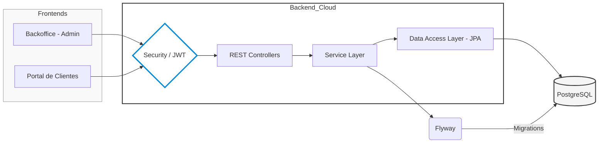

# ⚙️ ReparaSuite - Backend API (Núcleo Central)

Este repositorio contiene la API REST de **ReparaSuite**, una solución integral para la gestión de talleres de reparación electrónica. Construida sobre **Spring Boot 3.4** y **Java 21**, esta plataforma ofrece un backend robusto, escalable y seguro.

 
## 🏗️ Arquitectura y Flujo de Datos

El sistema sigue una arquitectura orientada a servicios, donde el backend centraliza la lógica de negocio y la persistencia de datos, exponiendo recursos mediante una interfaz RESTful documentada.

####  🔐 Seguridad y Autenticación
He implementado un esquema de seguridad basado en Stateless JWT (JSON Web Tokens) para garantizar comunicaciones seguras entre los frontends y la API:

Filtros de Seguridad: Implementación de OncePerRequestFilter para interceptar y validar tokens en cada petición.

Gestión de Roles: Autorización basada en perfiles (Técnico, Administrador, Cliente).

Cifrado: Manejo seguro de credenciales y configuración de CORS para entornos de producción.

#### 📖 Documentación Interactiva (Swagger/OpenAPI 3)
La API está totalmente documentada siguiendo el estándar OpenAPI 3. Esto permite a otros desarrolladores probar los endpoints en tiempo real.

#### 🚀 Stack Tecnológico
Lenguaje: Java 21 (Aprovechando Virtual Threads y Record types).

Framework: Spring Boot 3.4.

Base de Datos: PostgreSQL (Relacional).

Migraciones: Flyway para control de versiones del esquema de base de datos.

Testing: JUnit 5 y Mockito para asegurar la calidad del código.

#### 🛠️ Configuración del Entorno
Requisitos previos
JDK 21

Maven 3.9+

PostgreSQL 16+

Instalación rápida
Clonar: git clone https://github.com/GledysP/reparasuite-api.git

Base de Datos: Crear una base de datos llamada reparasuite en Postgres.

Propiedades: Ajustar src/main/resources/application.properties con tus credenciales.
